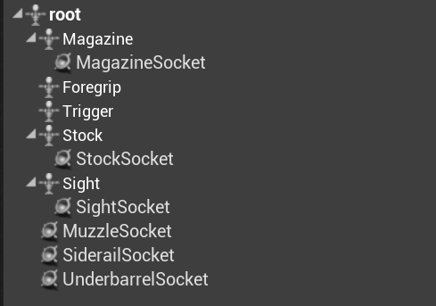
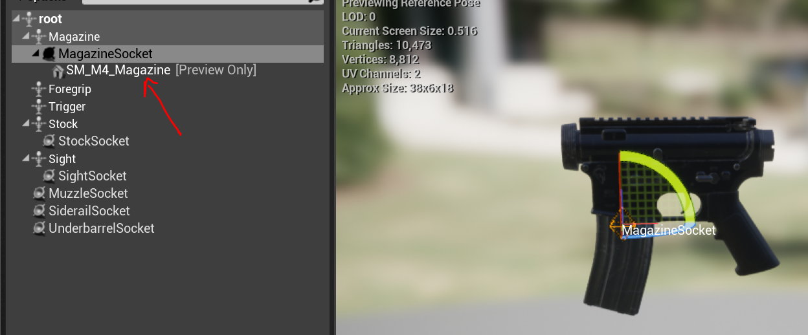
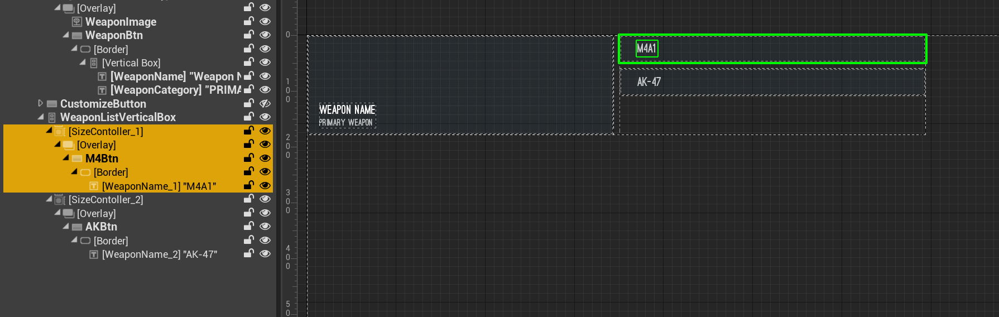
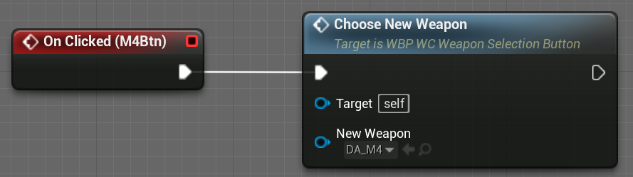

## Introduction

This is the documentation for the [Weapon Loadout and Customization](https://www.unrealengine.com/marketplace/en-US/profile/CB+Productions?count=20&sortBy=effectiveDate&sortDir=DESC&start=0) available on the UE4 Marketplace.

### Changelog and future Updates

- [x] 1.0 Release

## Getting Started

### Folder structure

The asset comes with two folders. The folder `WeaponCustomization` contains the core functionality. The folder `FirstPersonExample` contains the default UE4 First Person Template to showcase how to integrate the System into your project. If you don't require this example, you can simply delete this folder.

Inside the `WeaponCustomization` folder there are several important sub-folders:

| Folder | Description |
| --- | --- |
| Blueprints | Files for the core functionality |
| DataAssets | Contains all the DataAssets for Weapons and Weapon Attachments |
| UI | Contains all the UMG widgets that are used |
| WeaponAssets | Contains all the assets (meshes, textures, materials) |

## Adding new attachments

New attachments can be added by simply creating a new DataAsset or copying an existing DataAssets and modifying it. For demonstration purposes we create a new sight attachment: 

- Create a copy of the `DA_AimpointSight` DataAsset located within the `WeaponCustomization/DataAssets/Attachments` folder and open it 
- Assign the new static mesh and make sure to update all the information like Name, Descriptions, and Pros & Cons

As a final step, the new attachment needs to be added to the weapon. It needs to be every weapon individually. We are adding the new sight to the M4: 

- Open the `DA_M4` DataAsset within the `WeaponCustomization/DataAssets/Weapons` folder
- Add a new entry to the `Available Attachments` variable and select the newly created DataAsset

**Important:** We are done now at this point. The UI will update automatically. Adding the new DataAsset is all that is required.

## Adding new weapons

Adding a new weapon works similar to adding new attachments. In fact, when adding a new gun, you'll most likely will need to add new attachments as well. The process of adding a new new weapon will be explained by uisng the M4 as an example.

First of all we need to add the base mesh for the weapon. In case of the M4 this is just the receiver of the weapon, everything else is added as attachments:

Of course we could add more of the gun, but that would limit us in the amount of different attachments we can use. E.g. if the do not want to change the barrel on the gun, we can directly import that along with the receiver. The mesh needs to be imported as a skeletal mesh, with the root bone sitting at 0,0,0. After importing, open up the Skeletal Mesh asset and add all the necessary sockets:

If you do not plan to use a specific slot (e.g. you don't want to use the Underbarrel Slot), you don't have to add that socket. You can test your sockets by adding preview assets. In the following example we added the magazine mesh for testing:

Next we can add a new DataAsset for the weapon. Create a copy of `DA_M4` inside the `/WeaponCustomization/DataAssets/Weapons/` folder and rename it to suit the new weapon you are adding. Open it up and select the newly imported Skeletal Mesh. Delete all entries within the `Availalble Attachments` array, since we will be re-adding attachments later on. Fill out the remaining data like description etc.

Attachments are automatically added to the UI, new Weapons are currently not. However, this will change in the next update. For now, they will need to be added manually. To do that, open up the widget `WBP_WC_WeaponSelectionButton` within the folder `WeaponCustomization/UI/Widgets/`. Create a copy of the widgets marked in yellow and add it to the `WeaponListVerticalBox`:

Select the newly created button widget and add a OnClicked event. This OnClicked needs to call `ChooseNewWeapon`, with the newly created Weapon DataAsset as an input:

That's it. The new weapon is now functional and shows up in the UI. As a last step, we can now add all the necessary attachments (see the section above about "Adding new attachments").

## Integration into another Project

The integration into another project is kept simple. For a basic integration, only one component needs to be added to the existing weapon or character class.

In this example, we will integrate the system into the default UE4 First Person Template. This is already done in the project itself, so feel free to check out the implementation yourself.

Depending on the project you want to integrate this with, the steps will slightly differ. If your project has a dedicated weapon Blueprint we advise implementing the component there. The UE4 First Person Template doesn't have a dedicated weapon Blueprint, but rather puts the weapon mesh directly onto the player character. So first open the `FirstPersonCharacter` Blueprint. Add the `BP_WeaponComponent` and make it a child of the existing `FP_Gun` component:

Select the `FP_Gun` component and within the Details panel set *Visible* to false so that the original weapon does not show in-game. You can adjust the position of the `Mesh1P` component to better fit the weapon. Press Play and the last selected weapon, including all the attachments will now show up:

The project comes already implemented. Additionally, it allows easily customizing the weapon by returning to the main menu by pressing the M key:

This implementation is simply done by loading the main level: 

## Questions? 

For any further questions join the [Discord server](https://discord.gg/3xc2u3tr9V) or write us an email: support [at] cb-productions.de