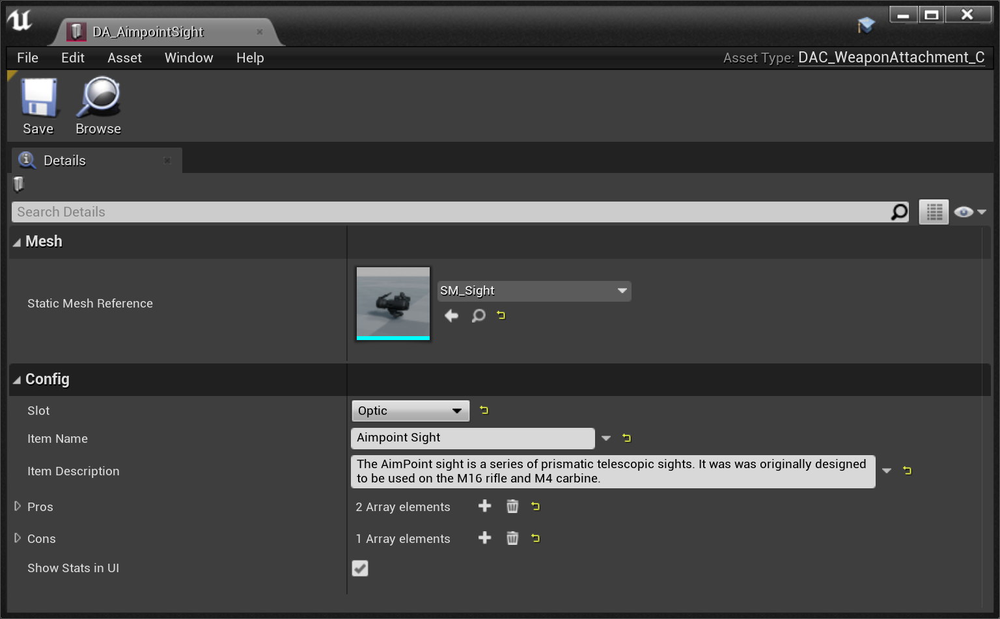
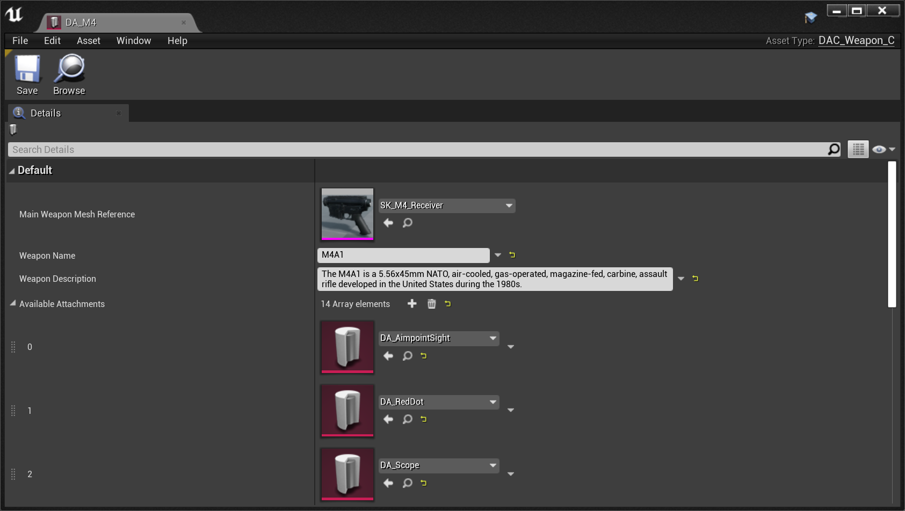
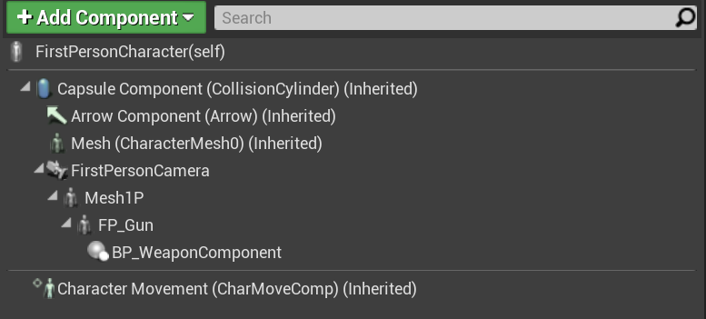
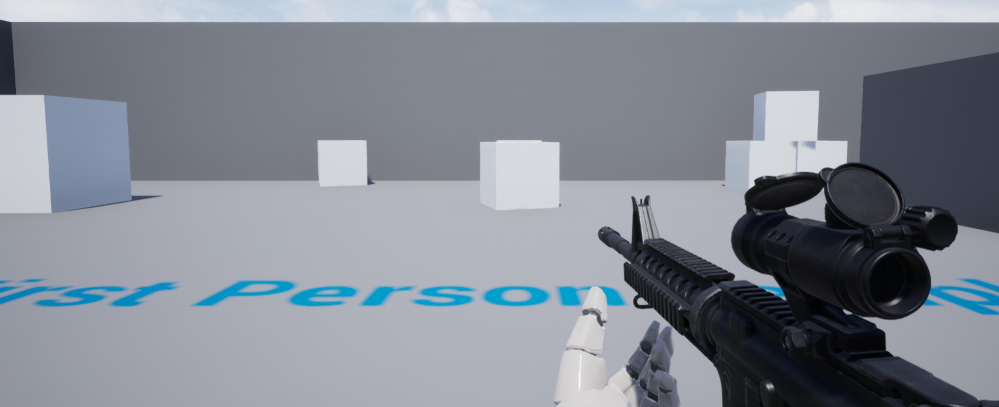
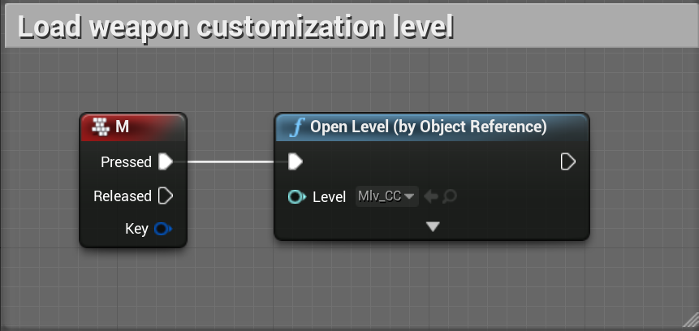

## Introduction

This is the documentation for the [Weapon Loadout and Customization](https://www.unrealengine.com/marketplace/en-US/profile/CB+Productions?count=20&sortBy=effectiveDate&sortDir=DESC&start=0) available on the UE4 Marketplace.

### Changelog and future Updates

- [x] 1.0 Release

## Getting Started

### Folder structure

The asset comes with two folders. The folder `WeaponCustomization` contains the core functionality. The folder `FirstPersonExample` contains the default UE4 First Person Template to showcase how to integrate the System into your project. If you don't require this example, you can simply delete this folder.

Inside the `WeaponCustomization` folder there are several important sub-folders:

| Folder | Description |
| --- | --- |
| Blueprints | Files for the core functionality |
| DataAssets | Contains all the DataAssets for Weapons and Weapon Attachments |
| UI | Contains all the UMG widgets that are used |
| WeaponAssets | Contains all the assets (meshes, textures, materials) |

## Adding new attachments

New attachments can be added by simply creating a new DataAsset or copying an existing DataAssets and modifying it. For demonstration purposes we create a new sight attachment: 

- Create a copy of the `DA_AimpointSight` DataAsset located within the `WeaponCustomization/DataAssets/Attachments` folder and open it 
- Assign the new static mesh and make sure to update all the information like Name, Descriptions, and Pros & Cons

As a final step, the new attachment needs to be added to the weapon. It needs to be every weapon individually. We are adding the new sight to the M4: 

- Open the `DA_M4` DataAsset within the `WeaponCustomization/DataAssets/Weapons` folder
- Add a new entry to the `Available Attachments` variable and select the newly created DataAsset

**Important:** We are done now at this point. The UI will update automatically. Adding the new DataAsset is all that is required.

## Integration into another Project

The integration into another project is kept simple. For a basic integration, only one component needs to be added to the existing weapon or character class.

In this example, we will integrate the system into the default UE4 First Person Template. This is already done in the project itself, so feel free to check out the implementation yourself.

Depending on the project you want to integrate this with, the steps will slightly differ. If your project has a dedicated weapon Blueprint we advise implementing the component there. The UE4 First Person Template doesn't have a dedicated weapon Blueprint, but rather puts the weapon mesh directly onto the player character. So first open the `FirstPersonCharacter` Blueprint. Add the `BP_WeaponComponent` and make it a child of the existing `FP_Gun` component:

Select the `FP_Gun` component and within the Details panel set *Visible* to false so that the original weapon does not show in-game. You can adjust the position of the `Mesh1P` component to better fit the weapon. Press Play and the last selected weapon, including all the attachments will now show up:

The project comes already implemented. Additionally, it allows easily customizing the weapon by returning to the main menu by pressing the M key:

This implementation is simply done by loading the main level: 

## Questions? 

For any further questions join the [Discord server](https://discord.gg/3xc2u3tr9V) or write us an email: support [at] cb-productions.de